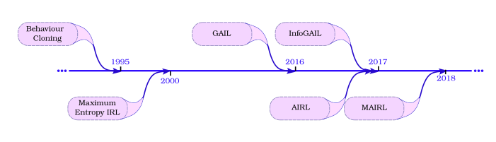
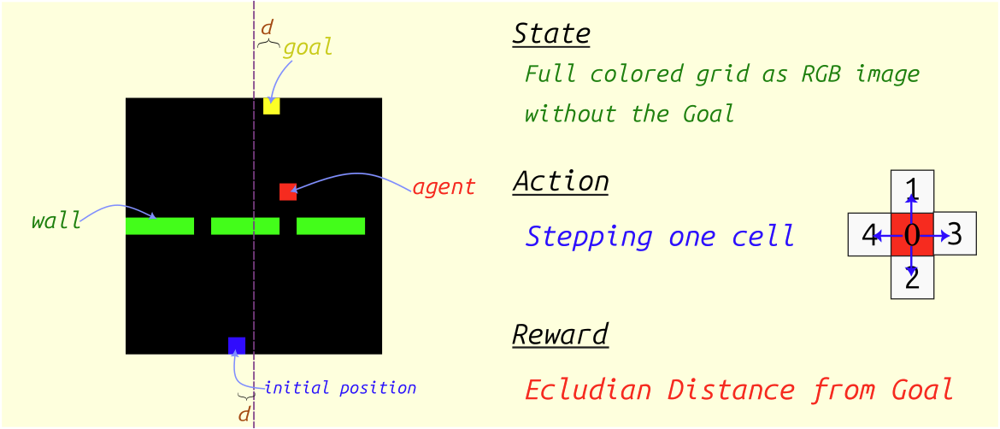
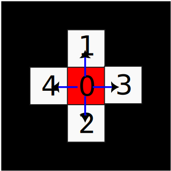
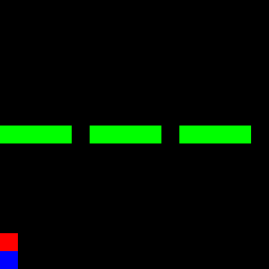
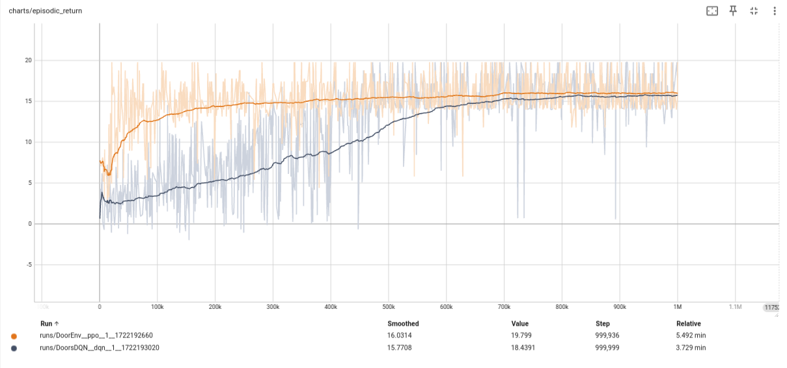
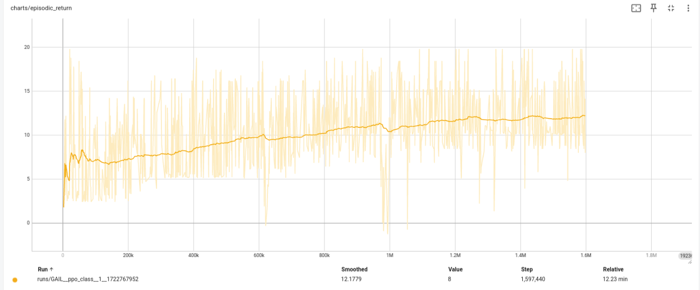
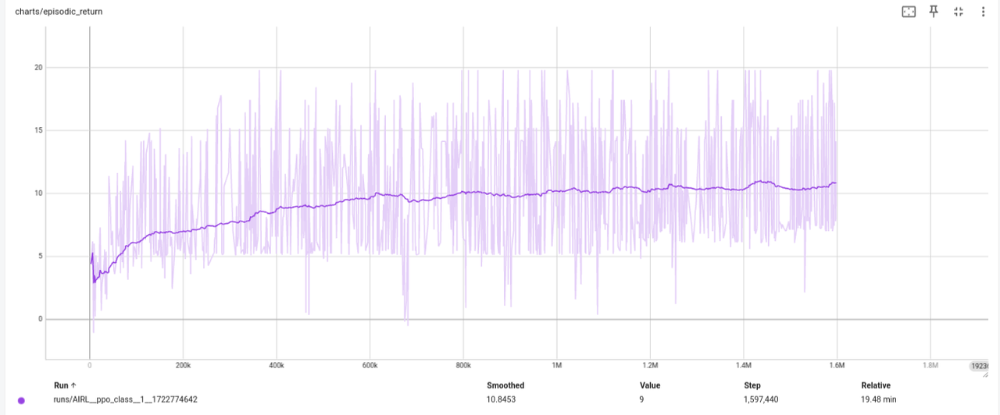
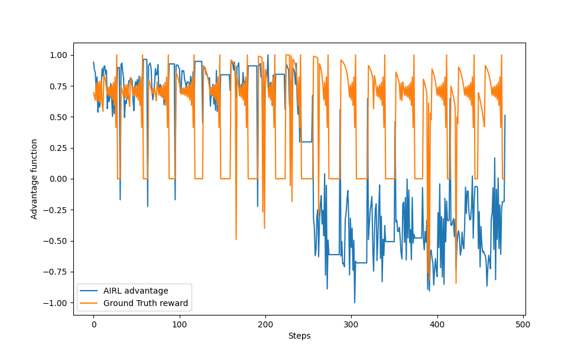
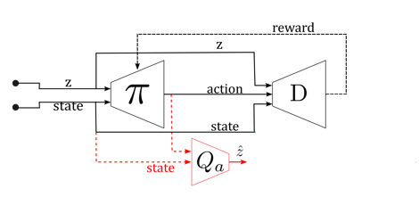
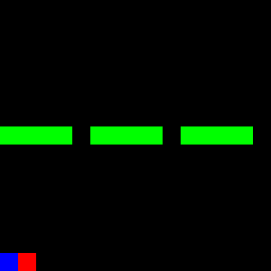

<!--
.. title: Hands-On Imitation Learning: From Behaviour Cloning to Multi-Modal Imitation Learning
.. slug: hands-on-imitation-learning
.. date: 2024-09-08 00:53:52 UTC+02:00
.. tags: deep-learning, reinforcement learning, review
.. category: 
.. link: 
.. description: A overview of the most prominent imitation learning methods with tests on a grid environment
.. type: text
.. has_math: true
-->

**An overview of the most prominent imitation learning methods with tests on a grid environment**

Reinforcement learning is one branch of machine learning concerned with learning by guidance of scalar signals (rewards); in contrast to supervised learning, which needs full labels of  the target variable.

<!--END_TEASER -->

An intuitive example to explian reinforcement learning can be given in terms of a school with two classes having two types of tests. The first class solves the test and gets the full correct answers (supervised learning: 
SL). The second class solves the test and gets only the grades for each question (reinforcement learning: RL). In the first case, it seems easier for the students to learn the correct 
answers and memorize them. In the second class, the task is harder because they can learn only by trial and error. However, their learning is more robust because they don't only know 
what is right but also all the wrong answers to avoid.

However, designing accurate RL reward signals (the grades) can be a difficult task, especially for real-world applications. For example, a human driver knows how to drive, but cannot 
set rewards for 'correct driving' skill, same thing for cooking or painting. This created the need for imitation learning methods (IL). IL is a new branch of RL concerned with learning 
from mere expert trajectories, without knowing the rewards. Main application areas of IL are in robotics and autonomous driving fields.

In the following, we will explore the famous methods of IL in the literature, ordered by their proposal time from old to new, as shown in the timeline picture below. Code snippets will 
be provided along with nomenclature of the relationships. However, the theoretical derivation is kept to a minimum here; if further depth is needed, the original references can be 
looked up as cited in the References section at the end. The full code for recreating all the experiments here is provided in the [github 
repo](https://www.github.com/engyasin/ilsurvey).

So, buckle up! and let's dive through imitation learning, from behavior cloning (BC) to information maximization generative adversarial imitation learning (InfoGAIL).

## Example Environment

The environment used in this post is represented as a 15x15 grid. The environment state is illustrated below:

- Agent: red color
- Initial agent location: blue color
- Walls: green color

The goal of the agent is to reach the first row in the shortest possible way and towards a symmetrical location with respect to the vertical axis passing through the middle of the 
grid. The goal location will not be shown in the state grid.

### Action Space

<table >
<tr><td>
The action space A consists of a discrete number from 0 to 4 representing movements in four directions and the stopping action, as illustrated below:
</td><td>
   
  </td></tr>

</table>

### Reward Function

The ground truth reward $R(s,a)$ is a function of the current state and action, with a value equal to the displacement distance towards the goal:

$$R(s,a) = ||p_1-p_{goal}|| - ||p_2-p_{goal}||$$

where $p_1$ is the old position and $p_2$ is the new position. The agent will always be initialized at the last row, but in a random position each time.

### Expert Policy

The expert policy used for all methods (except InfoGAIL) aims to reach the goal in the shortest possible path. This involves three steps:

1. Moving towards the nearest window
2. Moving directly towards the goal
3. Stopping at the goal location

This behavior is illustrated by a GIF:

The expert policy generates demonstration trajectories used by other IL methods, represented as an ordered sequence of state-action tuples.

$$ \tau = \{(s_0,a_0), ... (s_n,a_n)\} $$

where the expert demonstrations set is defined as $\mathcal{D} = \{\tau_0, \cdots, \tau_n \}$

> The expert episodic return was $16.33 \pm 6$ on average for 30 episodes with a length of 32 steps each.

## Forward Reinforcement Learning

First, we will train using the ground truth reward to set some baselines and tune hyperparameters for later use with IL methods.

The implementation of the Forward RL algorithm used in this post is based on Clean RL scripts [12], which provides a readable implementation of RL methods.

### Introduction

We will test both Proximal Policy Optimization (PPO) [2] and Deep Q-Network (DQN) [1], state-of-the-art on-policy and well-known off-policy RL methods, respectively.

The following is a summary of the training steps for each method, along with their characteristics:

#### On-Policy (PPO)

This method uses the current policy under training and updates its parameters after collecting rollouts for every episode. PPO has two main parts: critic and actor. The actor 
represents the policy, while the critic provides value estimations for each state with its own updated objective.

#### Off-Policy (DQN)

DQN trains its policy offline by collecting rollouts in a replay buffer using epsilon-greedy exploration. Unlike PPO, DQN does not take the best action according to the current policy 
for every state but rather selects a random action. This allows for exploration of different solutions. An additional target network may be used with less frequently updated versions 
of the policy to make the learning objective more stable.

### Results and Discussion

The following figure shows the episodic return curves for both methods. DQN is in black, while PPO is shown as an orange line.

For this simple example:

* Both PPO and DQN converge, but with a slight advantage for PPO. Neither method reaches the expert level of 16.6 (PPO comes close with 15.26).
* DQN seems slower to converge in terms of interaction steps, known as sample inefficiency compared to PPO.
* PPO takes longer training time, possibly due to actor-critic training, updating two networks with different objectives.

The parameters for training both methods are mostly the same. For a closer look at how these curves were generated, check the scripts `ppo.py` and `dqn.py` in the accompanying 
repository.

## Behaviour Cloning (BC)

Behaviour Cloning, first proposed in [4], is a direct IL method. It involves supervised learning to map each state to an action based on expert demonstrations $\mathcal{D}$. The 
objective is defined as:

$$ \pi bc = argmin_{\pi} \mathbb{E}_{s \sim \rho \pi } [l(\pi bc(s),\pi_E(s))]$$

where $\pi_{bc}$ is the trained policy, $\pi_E$ is the expert policy, and $l(\pi_{bc}(s),\pi_E(s))$ is the loss function between the expert and trained policy in response to the same 
state.

The difference between BC and supervised learning lies in defining the problem as an interactive environment where actions are taken in response to dynamic states (e.g., a robot moving 
towards a goal). In contrast, supervised learning involves mapping input to output, like classifying images or predicting temperature. This distinction is explained in [8].

In this implementation, the full set of initial positions for the agent contains only 15 possibilities. Consequently, there are only 15 trajectories to learn from, which can be 
memorized by the BC network effectively. To make the problem harder, we clip the size of the training dataset $\mathcal{D}$ to half (only 240 state-action pairs) and repeat this for 
all IL methods that follow in this post.

### Results

After training the model (as shown in `bc.py` script), we get an average episodic return of 11.49 with a standard deviation of 5.24.

This is much less than the forward RL methods before. The following GIF shows the trained BC model in action.

From the GIF, it's evident that almost two-thirds of the trajectories have learned to pass through the wall. However, the model gets stuck with the last third, as it cannot infer the 
true policy from previous examples, especially since it was given only half of the 15 expert trajectories to learn from.

## Maximum Entropy Inverse Reinforcement Learning (MaxENT)

MaxEnt [3] is another method to train a reward model separately (not iteratively), beside Behaviour Cloning (BC). Its main idea lies in maximizing the probability of taking expert 
trajectories based on the current reward function. This can be expressed as:

$$P(\tau) = \frac{1}{Z} \exp(\sum_{i=1}^N r(s_i))$$

Where $\tau$ is the trajectory state-action ordered pairs, $N$ is the trajectory length, and $Z$ is a normalizing constant of the sum of all possible trajectories returns under the 
given policy.

From there, the method derives its main objective based on the maximum entropy theorem [3], which states that the most representative policy fulfilling a given condition is the one 
with highest entropy $H$. Therefore, MaxEnt requires an additional reward that will maximize the entropy of the policy. This leads to maximizing the following formula:

$$argmax_\theta \mathcal{L}\theta = argmax_\theta \sum_{\tau \in T} \log(\frac{1}{Z_{\theta}} \exp(r_\theta (\tau)))$$

Which has the derivative:

$$ \frac{\partial \mathcal{L}\theta}{\partial \theta} =  \sum_{\tau \in T} (SVD_\tau - SVD_\theta) \frac{\partial r_\theta}{\partial \theta}$$

Where $SVD$ is the state visitation frequency, which can be calculated with a dynamic programming algorithm given the current policy.

In our implementation here of MaxEnt, we skip the training of a new reward, where the dynamic programming algorithm would be slow and lengthy. Instead, we opt to test the main idea of 
maximizing the entropy by re-training a BC model exactly as in the previous process, but with an added term of the negative entropy of the inferred action distribution to the loss. The 
entropy should be negative because we wish to maximize it by minimizing the loss.

### Results

After adding the negative entropy of the distributions of actions with a weight of 0.5 (choosing the right value is important; otherwise, it may lead to worse learning), we see a 
slight improvement over the performance of the previous BC model with an average episodic return of 11.56 now (+0.07). The small value of the improvement can be explained by the simple 
nature of the environment, which contains a limited number of states. If the state space gets bigger, the entropy will have a bigger importance.

## Generative Adversarial Imitation Learning (GAIL)

The original work on GAIL [5] was inspired by the concept of Generative Adversarial Networks (GANs), which apply the idea of adversarial training to enhance the generative abilities of 
a main model. Similarly, in GAIL, the concept is applied to match state-action distributions between trained and expert policies.

This can be derived as Kullback-Leibler divergence, as shown in the main paper [5]. The paper finally derives the main objective for both models (called generator and discriminator 
models in GAIL) as:

$$\max_{\omega} \min_{\theta} \mathbb{E}_{\pi\theta} [1 -\log(D_t(s_g,a_g))] + $$

$$\mathbb{E}_{\pi_E} [\log(D_t(s_E,a_E))] + H(\pi\theta)$$

Where $D_t$ is the discriminator, $\pi_{\theta}$ is the generator model (i.e., the policy under training), $\pi_{E}$ is the expert policy, and $H(\pi_{\theta})$ is the entropy of the 
generator model.

The discriminator acts as a binary classifier, while the generator is the actual policy model being trained.

### The Main Benefit of GAIL

The main benefit of GAIL over previous methods (and the reason it performs better) lies in its interactive training process. The trained policy learns and explores different states 
guided by the discriminator's reward signal.

### Results

After training GAIL for 1.6 million steps, the model converged to a higher level than BC and MaxEnt models. If continued to be trained, even better results can be achieved.

Specifically, we obtained an average episodic reward of 12.8, which is noteworthy considering that only 50% of demonstrations were provided without any real reward.

This figure shows the training curve for GAIL (with ground truth episodic rewards on the y-axis). It's worth noting that the rewards coming from $\log(D(s,a))$ will be more chaotic 
than the ground truth due to GAIL's adversarial training nature.

## Adversarial Inverse Reinforcement Learning (AIRL)

One remaining problem with GAIL is that the trained reward model, the discriminator, does not actually represent the ground truth reward. Instead, the discriminator is trained as a 
binary classifier between expert and generator state-action pairs, resulting in an average value of 0.5. This means that the discriminator can only be considered a surrogate reward.

To solve this problem, the paper in [6] reformulates the discriminator using the following formula:

$$D_{\omega}(s,a) = \frac{\exp f_{\omega}(s,a)}{\exp f_{\omega}(s,a) + \pi(a|s)}$$

where $f_{\omega}(s,a)$ should converge to the actual advantage function. In this example, this value represents how close the agent is to the invisible goal. The ground truth reward can be found by adding another term to include a shaped reward; however, for this experiment, we will restrict ourselves to the advantage function above.

### Results

After training the AIRL model with the same parameters as GAIL, we obtained the following training curve:

It is noted that given the same training steps (1.6 Million Steps), AIRL was slower to converge due to the added complexity of training the discriminator. However, now we have a 
meaningful advantage function, albeit with a performance of only 10.8 episodic reward, which is still good enough.

Let's examine the values of this advantage function and the ground truth reward in response to expert demonstrations. To make these values more comparable, we also normalized the 
values of the learned advantage function $f_{\omega}$. From this, we got the following plot:

In this figure, there are 15 pulses corresponding to the 15 initial states of the agent. We can see bigger errors in the trained model for the last half of the plot, which is due to 
the limited use of only half the expert demos in training.

For the first half, we observe a low state when the agent stands still at the goal with zero reward, while it was evaluated as a high value in the trained model. In the second half, 
there's a general shift towards lower values.

Roughly speaking, the learned function approximately follows the ground truth reward and has recovered useful information about it using AIRL.

## Information Maximization GAIL (InfoGAIL)

Despite the advancements made by previous methods, an important problem still persists in Imitation Learning (IL): multi-modal learning. To apply IL to practical problems, it is 
necessary to learn from multiple possible expert policies. For instance, when driving or playing football, there is no single "true" way of doing things; experts vary in their methods, 
and the IL model should be able to learn these variations consistently.

To address this issue, InfoGAIL was developed [7]. Inspired by InfoGAN [11], which conditions the style of outputs generated by GAN using an additional style vector, InfoGAIL builds on 
the GAIL objective and adds another criterion: maximizing the mutual information between state-action pairs and a new controlling input vector $z$. This objective can be derived as:

$$ max I(s,a;z) = max(H(z) - H(z|s,a)) $$

where estimating the posterior $p(z|s,a)$ is approximated with a new model, $Q$, which takes $(s,a)$ as input and outputs $z$.

The final objective for InfoGAIL can be written as:

$$ max_{\omega} min_{\theta} \mathbb{E}_{\pi\theta} [1 -\log(D_t(s_g,a_g))] + $$

$$\mathbb{E}_{\pi_E} [\log(D_t(s_E,a_E))] + $$

$$\mathbb{E}_{a_g \sim \pi \theta(s_g,z)} [\log(Q(z|s_g,a_g))] $$

As a result, the policy has an additional input, namely $z$, as shown in the following figure:

In our experiments, we generated new multi-modal expert demos where each expert could enter from one gap only (of the three gaps on the wall), regardless of their goal. The full demo 
set was used without labels indicating which expert was acting. The $z$ variable is a one-hot encoding vector representing the expert class with three elements (e.g., `[1 0 0]` for the 
left door). The policy should:

* Learn to move towards the goal
* Link randomly generated $z$ values to different modes of experts (thus passing through different doors)
* The $Q$ model should be able to detect which mode it is based on the direction of actions in every state

Note that the discriminator, Q-model, and policy model training graphs are chaotic due to adversarial training.

Fortunately, we were able to learn two modes clearly. However, the third mode was not recognized by either the policy or the Q-model. The following three GIFs show the learned expert  modes from InfoGAIL when given different values of $z$:

<table>
<tr><td> z = [1,0,0] </td><td> z = [0,1,0]  </td><td> z = [0,0,1]  </td></tr>
<tr><td>  </td><td>  </td><td>  </td></tr>

</table>

Lastly, the policy was able to converge to an episodic reward of around 10 with 800K training steps. With more training steps, better results can be achieved, even if the experts used in this example are not optimal.

## Final Overview and Conclusion

As we review our experiments, it's clear that all IL methods have performed well in terms of episodic reward criteria. The following table summarizes their performance:

<table >
     <thead >
       <tr>
         <th width="50%">Method</th>
         <th width="35%"> Episodic Return</th>
         <th width="15%"> Return STD</th>
       </tr>
       <hline>
     </thead>

<tr><td> Expert </td><td> 16.33 </td><td> 1.97 </td></tr>
<tr><td> DQN (Forward RL) </td><td> 15.15 </td><td> 4.42 </td></tr>
<tr><td> PPO (Forward RL) </td><td> 15.26 </td><td> 3.03 </td></tr>
<tr><td>  BC  </td><td> 11.49 </td><td> 5.34 </td></tr>
<tr><td> BC with entropy (MaxEnt) </td><td> 11.56 </td><td> 5.32 </td></tr>
<tr><td> GAIL </td><td> 12.07 </td><td> 3.42 </td></tr>
<tr><td> AIRL </td><td> 10.74 </td><td> 4.27 </td></tr>
<tr><td> InfoGAIL* </td><td> 10.27 </td><td> 4.30 </td></tr>
</table>

*\*InfoGAIL results are not comparable as the expert demos were based on multi-modal experts*

The table shows that GAIL performed the best for this problem, while AIRL was slower due to its new reward formulation, resulting in a lower return. InfoGAIL also learned well but  struggled with recognizing all three modes of experts.

### Conclusion

Imitation Learning is a challenging and fascinating field. The methods we've explored are suitable for grid simulation environments but may not directly translate to real-world 
applications. Practical uses of IL are still in its infancy, except for some BC methods. Linking simulations to reality introduces new errors due to differences of their nature.

Another open challenge in IL is Multi-agent Imitation Learning. Research like MAIRL [9] and MAGAIL [10] have experimented with multi-agent environments but a general theory for 
learning from multiple expert trajectories remains an open question.

The attached repository on GitHub provides a basic approach to implementing these methods, which can be easily extended. The code will be updated in the future. If you're interested in 
contributing, please submit an issue or pull request with your modifications. Alternatively, feel free to leave a comment as we'll follow up with updates.

## References

[1] Mnih, V. (2013). Playing atari with deep reinforcement learning. arXiv preprint arXiv:1312.5602.

[2] Schulman, J., Wolski, F., Dhariwal, P., Radford, A., & Klimov, O. (2017). Proximal policy optimization algorithms. arXiv preprint arXiv:1707.06347.

[3] Ziebart, B. D., Maas, A. L., Bagnell, J. A., & Dey, A. K. (2008, July). Maximum entropy inverse reinforcement learning. In Aaai (Vol. 8, pp. 1433-1438).

[4] Bain, M., & Sammut, C. (1995, July). A Framework for Behavioural Cloning. In Machine Intelligence 15 (pp. 103-129).

[5] Ho, J., & Ermon, S. (2016). Generative adversarial imitation learning. Advances in neural information processing systems, 29.

[6] Fu, J., Luo, K., & Levine, S. (2017). Learning robust rewards with adversarial inverse reinforcement learning. arXiv preprint arXiv:1710.11248.

[7] Li, Y., Song, J., & Ermon, S. (2017). Infogail: Interpretable imitation learning from visual demonstrations. Advances in neural information processing systems, 30.

[8] Osa, T., Pajarinen, J., Neumann, G., Bagnell, J. A., Abbeel, P., & Peters, J. (2018). An algorithmic perspective on imitation learning. Foundations and Trends® in Robotics, 7(1-2), 1-179.

[9] Yu, L., Song, J., & Ermon, S. (2019, May). Multi-agent adversarial inverse reinforcement learning. In International Conference on Machine Learning (pp. 7194-7201). PMLR.

[10] Song, J., Ren, H., Sadigh, D., & Ermon, S. (2018). Multi-agent generative adversarial imitation learning. Advances in neural information processing systems, 31.

[11] Chen, X., Duan, Y., Houthooft, R., Schulman, J., Sutskever, I., & Abbeel, P. (2016). Infogan: Interpretable representation learning by information maximizing generative adversarial nets. Advances in neural information processing systems, 29.

[12] Huang, S., Dossa, R. F. J., Ye, C., Braga, J., Chakraborty, D., Mehta, K., & AraÚjo, J. G. (2022). Cleanrl: High-quality single-file implementations of deep reinforcement learning algorithms. Journal of Machine Learning Research, 23(274), 1-18.

