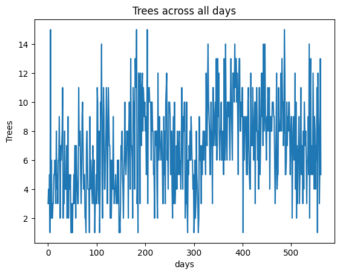
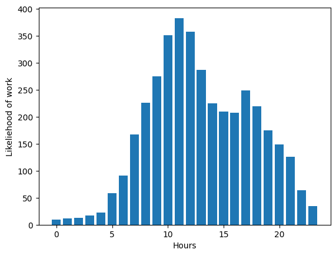
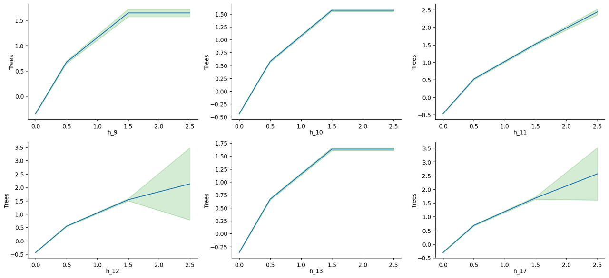
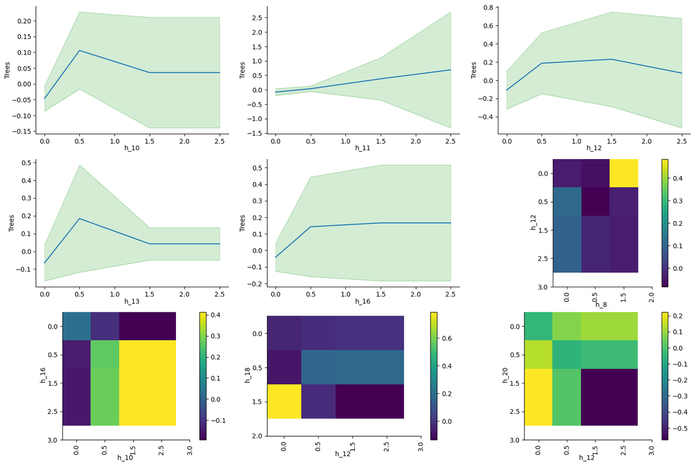
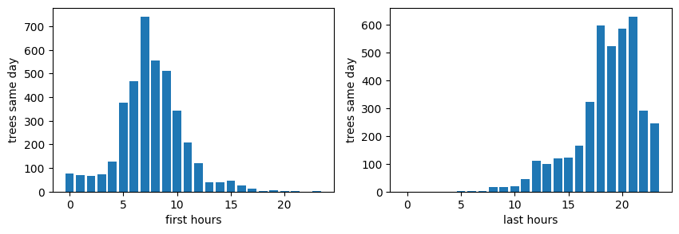
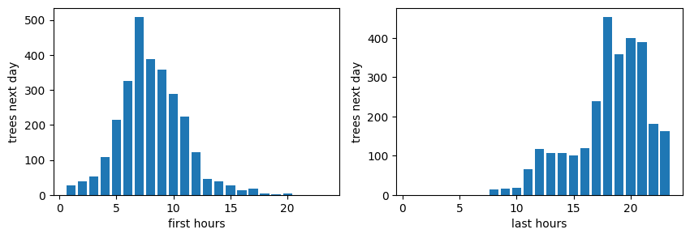

<!--
.. title: Tracking my Working Times for 804 Days
.. slug: tracking-my-working-times-for-804-days
.. date: 2024-04-14 13:25:04 UTC+02:00
.. tags: productivity, GAM, tips
.. category: 
.. link: 
.. description: 
.. type: text
.. medium: no
-->

### *Analyzing My Personal Time-Tracking Data to Find Recommendations for Optimal Daily Schedules*

# Introduction

As a student or knowledge worker, time management is essential for achieving success. However, organizing one's schedule can be challenging due to various factors such as distributing work and rest times in optimal time windows. To address this issue, analyzing previous working schedules of an individual may provide useful recommendations for them. 

<small><i>Photo by Jon Tyson on Unsplash</i></small>

In this post, we will process data collected using a mobile app called *Forest* [1], which I used to track my daily activities over 804 continuous days with some interruptions during vacation time.

## The Questions

After preprocessing the recorded time data of trees (each tree represents 40 minutes), we aimed to answer four questions:

1. What are the best daily working hours to maximize same-day productivity?
2. What are the best daily working hours to maximize next-day productivity?
3. What is the optimal starting and ending time for maximum work in a single day?
4. What is the optimal starting and ending time for maximum work in the following day?

We will attempt to answer these questions by training a Glass Box Model called Generalized Additive Model (GAM) implemented here [2]. For the last two questions, we'll use histograms of corresponding values to find the answers.

## Assumptions

While conducting this analysis, several assumptions and restrictions were considered:

* The analyzed data is based on my personal habits as a doctoral candidate in computer science; however, it may not be comprehensive since I did not record work time for every day (70% of the days had trees representing working hours), as shown below of the working data:

* Although this analysis focuses on my results, they are likely to benefit others with similar habits and can easily be generalized as demonstrated later in the post.

* Productivity is defined here as the amount of work time per day; thus, this study is about quantity rather than quality. While there may be a strong correlation between these two factors, it goes beyond the scope of this analysis to explore other definitions of productivity (see [3] for examples).

# Likelihood of Work

To analyze the likelihood of working in different hours throughout the day, we drew a histogram of daily work hours versus the number of trees planted at that hour. This graph provides insight into which hours are more productive and when they occur (see Figure below). The two peak hours can be observed between 8-13, while there is a drop in productivity from 14-17.

# Best Hour for Productivity in the Same Day

To determine how working during each hour independently affects overall daily productivity, we trained GAM using input vectors of trees started at each hour as 24-hour long features. The output of the model represents the number of trees planted that day. One advantage of GAM is its ability to provide a completely transparent white box model, allowing us to extract the exact non-linear relationship between each input feature and the output.

After training the GAM, we identified the six most important hours for productivity based on their influence on daily work time. These graphs are displayed below  along with uncertainty values for each graph.

Results from these graphs:

* The hours 11, 12, and 17 have the highest influence when two trees are planted in each hour, as they can reach an influence of above 2 for each.
* Hours 9, 10, and 13 also show similar patterns but become less productive after one tree. Having zero trees in these hours results in a negative value (-0.5 to -0.25), so it is essential to work at least one tree per hour or risk significant decreases in productivity.
* The graphs for the remaining hours show varying levels of influence, but they are generally less beneficial than the previously mentioned hours.

# Best Hour for Productivity in the Next Day

It is also interesting to see the effect of the working hours on the next day productivity, because we want to learn about sustainable performance. For example, if I worked for 15 trees one day and then only 5 the next day, then this is something we don't want to encourage. Therefore, we do the same training of the GAM model but with the trees of the next day as the output. We got the following graphs of the most important nine features:

Results from these graphs:

* The high uncertainty covers both negative and positive scales, indicating that the data is very noisy. In our case, we can see that there's no influence on working in hours like 10, 12, or 16 for the next day.
* If we focus on the means we can see that the hours 10,11,12,13 and 14 have a positive effect for the next day productivity for one tree of work for each.
* After one tree, working more in hours like 10 and 13 decrease the influence, and has no influence in hours like 11,12,16
* For the interactions, a positive effect is noted for working in both 16 and 10, and for working in either 12 or 20 but not both. And in general, in balancing the work for the hours 8 and 12, as well as 18 and 12.

# Best Starting and Ending Hours for Productivity on the Same Day

To determine which range of working hours is most productive, we plotted histograms of both starting hours versus the sum of trees planted in these days and ending hours with the same amount. The results are as follows:

No surprise that the best hour to start is 7, and the optimal range for ending hours is between 18-21 (peaking at around 6). Starting late or early appears detrimental to productivity. Similarly, ending work later than 21 also negatively impacts performance.

# Best Starting and Ending Hours for Productivity on the Next Day

We then conducted a similar analysis for next-day productivity:

It's interesting to note that starting at 7 am is beneficial not only for the current day but also for the following day. The same applies to ending hours, as it positively affects both present and future work performance.

# Conclusion

As final notes from our analysis, it is evident that:

* The peak working hours are within inclusive ranges [9-13] and [17-18].
* Starting at 7 am is optimal for both same day and next day productivity.
* Ending between 18 and 21 pm results in the best performance for both present and future work.

As personal insights, I found it surprising that working early doesn't necessarily lead to increased productivity, beside negatively impacting one's overall mood throughout the day. Additionally, the data highlights the importance of taking breaks during the afternoon (from 14 to 17) as a necessary recovery period for maintaining optimal performance levels.

*Lastly, if you find this post interesting and would like to discuss it further or share your thoughts, feel free to leave a comment below. Additionally, if you enjoy reading my work, consider visiting [my blog here](https://engyasin.github.io) and subscribing to my newsletter for future posts on data analysis and insights.*

# References

[1] Forest. Available at: https://www.forestapp.cc/ (Accessed: 14 April 2024).

[2] Nori, H., Jenkins, S., Koch, P., & Caruana, R. (2019). Interpretml: A unified framework for machine learning interpretability. arXiv preprint arXiv:1909.09223.

[3] Newport, C. (2024). Slow productivity: the lost art of accomplishment without burnout . Portfolio/Penguin.
