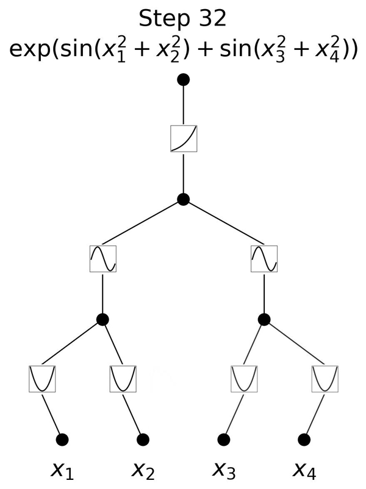
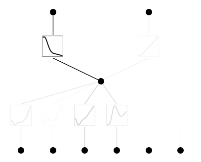
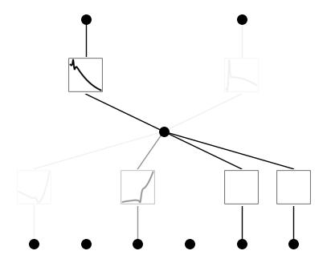

<!--
.. title: Why is the (KAN) Kolmogorov-Arnold Networks so promising
.. slug: why-the-new-kolmogorov-arnold-networks-so-promising
.. date: 2024-05-19 09:25:52 UTC+02:00
.. tags: deep-learning, ai, interpretability, additve-models
.. category: 
.. link: 
.. description: An example of KAN
.. type: text
.. has_math: true
.. medium: yes
.. author: Yasin Yousif (llama3-comments)
-->

*Recently, (yet) another new neural network structure was proposed. Namely, Kolmogorov-Arnold Network (KAN). Soon this new structure attracted a lot of attention, and for good reason: interpretability. For what current Multi Layers Preceptron (MLPs) networks lack is a way to make sense of the network predictions. Magic isn't involved; we need to know how the learning is done, so we can improve, fix, or extend it in an efficient manner. KANs take a significant step forward in this regard using addition operators, which have been proven to represent higher-order functions effectively.*

<!--END_TEASER -->

>> **llama3**: *"How does the addition operator in KANs compare to other methods for representing high-order functions, such as Fourier series or wavelet expansions? Can we expect similar benefits in terms of interpretability?"*

 

# What is KAN?

Basically, KAN [1] introuduces a new learning theory for training Neural Networks based on Kolmogorov-Arnold theorem of representing a multi-varaite continous function $f$ on a bounded domain:

$$ f(x)=f(x_1,\cdots,x_n) = \sum^{2n+1}\_{q=1}\Phi_q \left( \sum^{n}\_{p=1} \phi\_{p,q} (x_p) \right) $$

The main change is training the activiation functions instead of weights in regular MLP , in addition to using these functions on the edges instead of node, while simply doing summsion on the node. This is depicted in the figure below, taken from the authors github page.


<center>
<small><i>Source: https://github.com/KindXiaoming/pykan</i></small>
</center>


This new structure will allow training using internal degrees of freedom of a dataset instead of external degrees of freedom like in MLPs.

>> **llama3**: *"Can you also explain why using internal degrees of freedom is  beneficial? Is it related to the concept of 'intrinsic' vs 'extrinsic' features?"*

## Advantages of KAN

As listed by the paper [1], based on extended experiments using synthatic mathimatical and physical datasets, KAN showed:

- Improved **accuracy** of the trained models over their MLP counterparts
- Improved **interpretability** than MLP, by showing its ability to extract the symbolic relationships generating the dataset, which is a high level of interpretability a developer can aim for. 

- Improved **size** of the trained parameters, where the KAN models require less number of parameters to reach same of level of accuracy of that of MLP models.
- Better **continous learning**, with less suffering of the catastrophic forgetting problem. Simply put, learning a new task of a pretrained KAN model on an old task will damage less its effeciancy of the old task, than the case of MLP, where the network can 'forget' the old task.

>> **llama3**: *"Continous learning is a huge advantage, especially in scenarios where data distributions change over time. Can you elaborate on how KAN's ability to handle catastrophic forgetting compares to other techniques for overcoming this issue? Are there any specific use cases where this becomes particularly important?"*

## Disadvantages of KAN

- When compared with MLP, KAN suffers from **slow training process**, due to incapability of dealing with batches of the data. This will slow the training process, however, some solutions have already been proposed like [efficentKAN](https://github.com/Blealtan/efficient-kan) or [fast-KAN](https://github.com/ZiyaoLi/fast-kan)


# Usage of KAN

KAN can be used when we care about interpretability or accuracy. In the original paper several examples were shown. Here we will focus on practical example, using traffic trajectory prediction, of pedistrains in InD dataset [2]. We will use the main python library introudced in the paper [`pykan`](https://github.com/KindXiaoming/pykan). Additionally, we will follow the exact steps recommended in the paper, namely: training with regularziation, visualization, pruning, symbolification.


>> **llama3**: *"I'm curious about the impact of regularization on KAN's performance. Is it a necessary step for achieving good results, or is it more of a tuning parameter that can be adjusted depending on the specific problem?"*

## Loading the processed dataset

We will load a preprocessed version of InD dataset [2] trajectories, in the format of the absoulte coordinates of the last 3 points of the trajectory. Each points is 0.4 second away from the next and the last one of them is 4.8 seconds away from the traget point we want to predict. This is a slightly simplified version of the standards in the literature where 8 points are usually taken as the input. Namely:

- Input: $[x_0,y_0,x_1,y_1,x_2,y_2]$
- Output: $[x_{14}, y_{14}]$

With the code:

```python
if os.path.isfile('ind_train.npy'):
    yx_all = np.load('ind_train.npy')
    yx_test_all = np.load('ind_test.npy')
else:
    np.save('ind_train.npy',yx_all)
    np.save('ind_test.npy',yx_test_all)
```

>> **llama3**: *"I'd love to see more examples of how KAN can be used to model real-world phenomena, like traffic patterns or even climate models. Can you provide some additional resources for those interested in exploring this further?"*

## Training with KAN

Next step is to load, KAN model, with suitable size. We will use only one hiddin layer with 4 nodes:

```python
# create a KAN: 2D inputs, 1D output, and 4 hidden neurons. cubic spline (k=3), 6 grid intervals (grid=6).
model = KAN(width=[6,4,2], grid=6, k=3, seed=0,device = device),
```

Then we put the training data is suitable format:

```python
with torch.no_grad():
    dataset['train_input'] = torch.Tensor(yx_all[:,sub_points]).cuda()
    dataset['train_label'] = torch.Tensor(yx_all[:,:2]).cuda()

    dataset['test_input'] = torch.Tensor(yx_test_all[:,sub_points]).cuda()
    dataset['test_label'] = torch.Tensor(yx_test_all[:,:2]).cuda()
```

## Visulizing and Training

Now we train, and show the resulting model

```python
# plot KAN at initialization
model(dataset['train_input'])
model.plot(beta=100)

# train
model.train(dataset, opt="LBFGS", steps=50, lamb=0.01, lamb_entropy=10., device=device)
```


## Pruning

The process is of removing unimportant connection is called pruninng, and it helps the model remove noise and dicover relationships in the dataset. This comes at  little cost of accuracy.


```python
model = model.prune(threshold=0.05)
model(dataset['train_input'])
model.plot()
```




Then we train again the prunned model:

```python
model.train(dataset, opt="LBFGS", steps=50,device=device)
model.plot()
```





## Symbolification

One of the benifits of KAN is the relative ease of fitting mathimatical expressions on the learned spline functions. 
With the following code, we demand using only one of set of very common functions,

```python
lib = ['x','x^2','x^3','x^4','exp','log','sqrt','tanh','sin','abs']
model.auto_symbolic(lib=lib)

model.train(dataset, opt="LBFGS", steps=50,device=device)
```

To check the detected functions we use:

```python
model.symbolic_formula()
```

Output

```python
X = 7.34 - 2.01*Abs(0.09*sin(2.23*x_1 - 8.98) - 1.32*tanh(9.99*x_3 + 4.48) + 0.01*tanh(10.0*x_4 - 0.2) - 0.01*Abs(10.0*x_2 - 0.2) - 1.4 + 0.03*exp(-10.0*x_6) + 0.03*exp(-10.0*x_5)),
```
```python
Y = -9.24*tanh(0.17*sin(2.23*x_1 - 8.98) - 2.53*tanh(9.99*x_3 + 4.48) + 0.02*tanh(10.0*x_4 - 0.2) - 0.02*Abs(10.0*x_2 - 0.2) - 6.02 + 0.06*exp(-10.0*x_6) + 0.06*exp(-10.0*x_5)) - 9.23
```

Hmm, the loss of this model is 1.4 meters for x-coordinates and 0.99 meters for y-coordinates, which is not so bad. We can see also that for Ys predictions we have `tanh` function, while direct `abs` for the Xs. This is resonable since the movement is on the X-axis.

More meaningful relationships can be induced with retraining using different seeds and using expected functions and values in this case, but for our demonstration example, this sufficies.


>> **llama3**: *"I'm wondering if there are any limitations to the types of relationships that KAN can discover. Are there certain classes of problems where symbolic formulas may not be as effective?"*


# Conclusion

This examples on practical traffic prediction problem, shows that KAN network do learn accuratly, with the ability to adjust and tune the learning process so it suits our application. Knowledge extraction is an important ascpect of KAN, and one of the reasons it will continue to be developed in more application areas, like vision or langaguge models.


>> **llama3**: *"I think the takeaway from this example is that KAN networks can be a powerful tool for tackling complex prediction problems. What do you think are the most promising  areas where KAN will make the biggest impact in the future?"*

# Refernces

[1] Liu, Z., Wang, Y., Vaidya, S., Ruehle, F., Halverson, J., Soljačić, M., ... & Tegmark, M. (2024). Kan: Kolmogorov-arnold networks. arXiv preprint arXiv:2404.19756.

[2] Bock, J., Krajewski, R., Moers, T., Runde, S., Vater, L., & Eckstein, L. (2020, October). The ind dataset: A drone dataset of naturalistic road user trajectories at german intersections. In 2020 IEEE Intelligent Vehicles Symposium (IV) (pp. 1929-1934). IEEE.